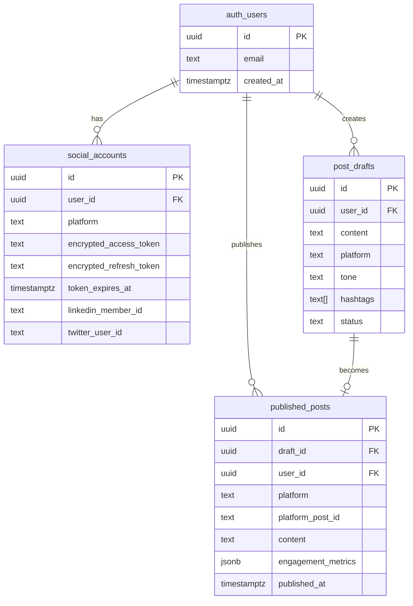

# Database Schema Documentation

## Overview

Vibe Posts uses **Supabase PostgreSQL** as its database with **Row-Level Security (RLS)** enabled for multi-tenant data isolation. The schema supports the complete post lifecycle from draft creation through publishing to social media platforms.

**Key Features:**
- Multi-tenant isolation via RLS policies
- Encrypted token storage (AES-256-GCM)
- Automatic timestamp management
- Foreign key constraints for data integrity
- Comprehensive indexing for query performance

---

## Current Schema Version

**Latest Migration:** `005_add_twitter_user_id.sql` (November 4, 2025)

**Migration History:**
1. `003_social_accounts_and_posts.sql` - Initial schema creation
2. `004_add_linkedin_member_id.sql` - Added LinkedIn member ID support
3. `005_add_twitter_user_id.sql` - Added Twitter user ID support

---

## Tables

### 1. `social_accounts`

Stores encrypted OAuth tokens and account information for connected social media platforms.

**Purpose:** Manage user connections to LinkedIn and Twitter with secure token storage.

#### Schema

| Column | Type | Constraints | Description |
|--------|------|-------------|-------------|
| `id` | UUID | PRIMARY KEY | Unique identifier (auto-generated) |
| `user_id` | UUID | NOT NULL, FK → auth.users(id) | Supabase auth user reference |
| `platform` | TEXT | NOT NULL, CHECK IN ('linkedin', 'twitter') | Social media platform |
| `encrypted_access_token` | TEXT | NOT NULL | AES-256-GCM encrypted OAuth access token |
| `encrypted_refresh_token` | TEXT | NULLABLE | AES-256-GCM encrypted OAuth refresh token |
| `token_expires_at` | TIMESTAMPTZ | NULLABLE | Token expiration timestamp |
| `linkedin_member_id` | TEXT | NULLABLE | LinkedIn member ID (from OIDC sub claim) |
| `twitter_user_id` | TEXT | NULLABLE | Twitter user ID (from API v2 /users/me) |
| `created_at` | TIMESTAMPTZ | DEFAULT NOW() | Record creation timestamp |
| `updated_at` | TIMESTAMPTZ | DEFAULT NOW() | Last update timestamp (auto-updated) |

**Constraints:**
- `UNIQUE(user_id, platform)` - One account per platform per user
- `FOREIGN KEY (user_id) REFERENCES auth.users(id) ON DELETE CASCADE`

#### Indexes

```sql
idx_social_accounts_user_id           -- Fast user lookups
idx_social_accounts_platform          -- Platform filtering
idx_social_accounts_created_at        -- Chronological sorting
idx_social_accounts_linkedin_member_id -- LinkedIn member lookups (WHERE platform = 'linkedin')
idx_social_accounts_twitter_user_id   -- Twitter user lookups (WHERE platform = 'twitter')
```

#### RLS Policies

- **SELECT:** Users can only view their own social accounts (`auth.uid() = user_id`)
- **INSERT:** Users can only insert their own social accounts
- **UPDATE:** Users can only update their own social accounts
- **DELETE:** Users can only delete their own social accounts

#### Example Usage

```typescript
// Fetch user's connected accounts
const { data: accounts } = await supabase
  .from('social_accounts')
  .select('*')
  .eq('user_id', userId);

// Store encrypted LinkedIn token
await supabase.from('social_accounts').insert({
  user_id: userId,
  platform: 'linkedin',
  encrypted_access_token: encryptedToken,
  encrypted_refresh_token: encryptedRefreshToken,
  token_expires_at: expiresAt,
  linkedin_member_id: memberIdFromOIDC,
});
```

---

### 2. `post_drafts`

Stores draft posts with content, metadata, and status tracking throughout the post lifecycle.

**Purpose:** Manage post creation, editing, and scheduling before publication.

#### Schema

| Column | Type | Constraints | Description |
|--------|------|-------------|-------------|
| `id` | UUID | PRIMARY KEY | Unique identifier (auto-generated) |
| `user_id` | UUID | NOT NULL, FK → auth.users(id) | Supabase auth user reference |
| `content` | TEXT | NOT NULL | Post content/body text |
| `platform` | TEXT | NOT NULL, CHECK IN ('linkedin', 'twitter', 'both') | Target platform(s) |
| `tone` | TEXT | NULLABLE, CHECK IN ('technical', 'casual', 'inspiring') | Writing tone preference |
| `hashtags` | TEXT[] | NULLABLE | Array of hashtags (without # prefix) |
| `status` | TEXT | NOT NULL, DEFAULT 'draft', CHECK IN ('draft', 'scheduled', 'published', 'failed') | Post lifecycle status |
| `created_at` | TIMESTAMPTZ | DEFAULT NOW() | Draft creation timestamp |
| `updated_at` | TIMESTAMPTZ | DEFAULT NOW() | Last edit timestamp (auto-updated) |

**Constraints:**
- `FOREIGN KEY (user_id) REFERENCES auth.users(id) ON DELETE CASCADE`

#### Indexes

```sql
idx_post_drafts_user_id     -- Fast user lookups
idx_post_drafts_platform    -- Platform filtering
idx_post_drafts_status      -- Status-based queries
idx_post_drafts_created_at  -- Chronological sorting
```

#### RLS Policies

- **SELECT:** Users can only view their own drafts (`auth.uid() = user_id`)
- **INSERT:** Users can only create their own drafts
- **UPDATE:** Users can only update their own drafts
- **DELETE:** Users can only delete their own drafts

#### Status Flow

```
draft → scheduled → published
          ↓
        failed (can retry)
```

#### Example Usage

```typescript
// Create new draft
const { data: draft } = await supabase.from('post_drafts').insert({
  user_id: userId,
  content: 'Excited to share...',
  platform: 'linkedin',
  tone: 'casual',
  hashtags: ['ProductDevelopment', 'AI'],
  status: 'draft',
});

// Update draft status after publishing
await supabase.from('post_drafts')
  .update({ status: 'published' })
  .eq('id', draftId);
```

---

### 3. `published_posts`

Stores published posts with engagement metrics and platform-specific IDs for tracking and analytics.

**Purpose:** Record successful publications and track engagement over time.

#### Schema

| Column | Type | Constraints | Description |
|--------|------|-------------|-------------|
| `id` | UUID | PRIMARY KEY | Unique identifier (auto-generated) |
| `draft_id` | UUID | NULLABLE, FK → post_drafts(id) | Source draft reference (NULL if ad-hoc) |
| `user_id` | UUID | NOT NULL, FK → auth.users(id) | Supabase auth user reference |
| `platform` | TEXT | NOT NULL, CHECK IN ('linkedin', 'twitter') | Publication platform |
| `platform_post_id` | TEXT | NOT NULL | Platform-returned post ID |
| `content` | TEXT | NOT NULL | Actual published content |
| `published_at` | TIMESTAMPTZ | DEFAULT NOW() | Publication timestamp |
| `engagement_metrics` | JSONB | NULLABLE | Likes, comments, shares, impressions |
| `created_at` | TIMESTAMPTZ | DEFAULT NOW() | Record creation timestamp |
| `updated_at` | TIMESTAMPTZ | DEFAULT NOW() | Last update timestamp (auto-updated) |

**Constraints:**
- `UNIQUE(platform, platform_post_id)` - Prevent duplicate post records
- `FOREIGN KEY (draft_id) REFERENCES post_drafts(id) ON DELETE SET NULL`
- `FOREIGN KEY (user_id) REFERENCES auth.users(id) ON DELETE CASCADE`

#### Indexes

```sql
idx_published_posts_user_id       -- Fast user lookups
idx_published_posts_platform      -- Platform filtering
idx_published_posts_draft_id      -- Draft-to-published linking
idx_published_posts_published_at  -- Chronological sorting (DESC)
```

#### RLS Policies

- **SELECT:** Users can only view their own published posts (`auth.uid() = user_id`)
- **INSERT:** Users can only insert their own published posts
- **UPDATE:** Users can only update their own published posts (for engagement metrics)
- **DELETE:** Users can only delete their own published posts

#### Engagement Metrics Structure

```typescript
{
  "likes": 42,
  "comments": 8,
  "shares": 5,
  "impressions": 1234,
  "engagement_rate": 4.46,
  "last_updated": "2025-11-06T12:00:00Z"
}
```

#### Example Usage

```typescript
// Record published post
const { data: published } = await supabase.from('published_posts').insert({
  draft_id: draftId,
  user_id: userId,
  platform: 'linkedin',
  platform_post_id: 'urn:li:share:7123456789',
  content: actualPublishedContent,
  published_at: new Date().toISOString(),
});

// Update engagement metrics
await supabase.from('published_posts')
  .update({
    engagement_metrics: {
      likes: 42,
      comments: 8,
      shares: 5,
      impressions: 1234,
      last_updated: new Date().toISOString(),
    }
  })
  .eq('id', publishedPostId);

// Get user's publishing history
const { data: history } = await supabase
  .from('published_posts')
  .select('*')
  .eq('user_id', userId)
  .order('published_at', { ascending: false })
  .limit(50);
```

---

## Database Relationships



---

## Security Model

### Row-Level Security (RLS)

**All tables have RLS enabled** to ensure multi-tenant data isolation. Users can only access their own data.

**Policy Pattern:**
```sql
-- Example: Users can only view their own data
CREATE POLICY "policy_name"
  ON table_name
  FOR SELECT
  USING (auth.uid() = user_id);
```

### Token Encryption

OAuth tokens are encrypted using **AES-256-GCM** before storage:

**Encryption Flow:**
1. Receive OAuth access/refresh tokens from provider
2. Encrypt using AES-256-GCM with `ENCRYPTION_KEY` from environment
3. Store encrypted value in `encrypted_access_token` column
4. Decrypt when needed for API calls

**Implementation:** See `src/lib/storage/supabase.ts`

---

## Automatic Features

### 1. Timestamp Management

All tables have automatic `updated_at` timestamp updates via triggers:

```sql
CREATE TRIGGER update_{table}_updated_at
  BEFORE UPDATE ON public.{table}
  FOR EACH ROW
  EXECUTE FUNCTION public.update_updated_at_column();
```

### 2. Cascade Deletes

When a user is deleted from `auth.users`, all related data is automatically deleted:
- All `social_accounts` entries
- All `post_drafts` entries
- All `published_posts` entries

When a draft is deleted, published posts retain the content but `draft_id` is set to NULL.

---

## Setup Instructions

### 1. Run Migrations

Execute migrations in order using Supabase SQL Editor or CLI:

```bash
# In Supabase SQL Editor, run these files in order:
1. src/lib/db/migrations/003_social_accounts_and_posts.sql
2. src/lib/db/migrations/004_add_linkedin_member_id.sql
3. src/lib/db/migrations/005_add_twitter_user_id.sql
```

### 2. Verify Setup

```sql
-- Check tables exist
SELECT table_name
FROM information_schema.tables
WHERE table_schema = 'public'
  AND table_name IN ('social_accounts', 'post_drafts', 'published_posts');

-- Verify RLS is enabled
SELECT tablename, rowsecurity
FROM pg_tables
WHERE schemaname = 'public'
  AND tablename IN ('social_accounts', 'post_drafts', 'published_posts');

-- List all policies
SELECT schemaname, tablename, policyname
FROM pg_policies
WHERE tablename IN ('social_accounts', 'post_drafts', 'published_posts');
```

### 3. Required Environment Variables

```bash
NEXT_PUBLIC_SUPABASE_URL=https://your-project.supabase.co
NEXT_PUBLIC_SUPABASE_ANON_KEY=your_anon_key_here
SUPABASE_SERVICE_KEY=your_service_role_key_here
ENCRYPTION_KEY=your_32_character_encryption_key
```

---

## Query Patterns

### Common Queries

```typescript
// Check if user has LinkedIn connected
const hasLinkedIn = await supabase
  .from('social_accounts')
  .select('id')
  .eq('user_id', userId)
  .eq('platform', 'linkedin')
  .single();

// Get all drafts for editing
const { data: drafts } = await supabase
  .from('post_drafts')
  .select('*')
  .eq('user_id', userId)
  .eq('status', 'draft')
  .order('updated_at', { ascending: false });

// Analytics: Get engagement summary
const { data: analytics } = await supabase
  .from('published_posts')
  .select('engagement_metrics')
  .eq('user_id', userId)
  .gte('published_at', thirtyDaysAgo);

// Find published post by platform ID
const { data: post } = await supabase
  .from('published_posts')
  .select('*')
  .eq('platform', 'linkedin')
  .eq('platform_post_id', linkedInPostId)
  .single();
```

---

## Performance Considerations

### Indexed Columns

All foreign keys, platform fields, status fields, and timestamp fields are indexed for optimal query performance.

### JSONB Performance

The `engagement_metrics` JSONB column supports efficient querying:

```sql
-- Query by specific metric
SELECT * FROM published_posts
WHERE (engagement_metrics->>'likes')::int > 100;

-- Create GIN index for complex JSONB queries (if needed)
CREATE INDEX idx_engagement_metrics
ON published_posts USING GIN (engagement_metrics);
```

### Pagination Best Practices

```typescript
// Use cursor-based pagination for large datasets
const { data: posts } = await supabase
  .from('published_posts')
  .select('*')
  .eq('user_id', userId)
  .order('published_at', { ascending: false })
  .range(offset, offset + limit - 1);
```

---

## Migration Strategy

### Adding New Columns

```sql
-- Always use IF NOT EXISTS for idempotency
ALTER TABLE public.social_accounts
ADD COLUMN IF NOT EXISTS new_column_name TEXT;

-- Add indexes for new columns
CREATE INDEX IF NOT EXISTS idx_name
ON public.social_accounts(new_column_name);

-- Add comments for documentation
COMMENT ON COLUMN public.social_accounts.new_column_name
IS 'Description of what this column stores';
```

### Rollback Strategy

Keep rollback scripts for each migration:

```sql
-- Rollback for 005_add_twitter_user_id.sql
DROP INDEX IF EXISTS idx_social_accounts_twitter_user_id;
ALTER TABLE public.social_accounts DROP COLUMN IF EXISTS twitter_user_id;
```

---

## Troubleshooting

### Common Issues

**Issue:** RLS policies preventing inserts

```sql
-- Check if RLS is properly configured
SELECT * FROM pg_policies WHERE tablename = 'social_accounts';

-- Temporarily disable RLS for debugging (DEV ONLY)
ALTER TABLE public.social_accounts DISABLE ROW LEVEL SECURITY;
```

**Issue:** Token decryption failures

- Verify `ENCRYPTION_KEY` is exactly 32 characters
- Check that the same key is used for encryption and decryption
- Ensure encrypted tokens are stored as TEXT (not JSONB)

**Issue:** Duplicate key violations

- `UNIQUE(user_id, platform)` on social_accounts - User already has this platform connected
- `UNIQUE(platform, platform_post_id)` on published_posts - Post already recorded

---

## Related Files

**Migration Files:**
- `src/lib/db/migrations/003_social_accounts_and_posts.sql`
- `src/lib/db/migrations/004_add_linkedin_member_id.sql`
- `src/lib/db/migrations/005_add_twitter_user_id.sql`

**TypeScript Types:**
- `src/types/database.ts` - Database table type definitions

**Database Operations:**
- `src/lib/db/posts.ts` - CRUD operations for drafts and published posts
- `src/lib/storage/supabase.ts` - Supabase client and token encryption

**API Routes Using Database:**
- `src/app/api/posts/route.ts` - Fetch publishing history
- `src/app/api/publish/linkedin/route.ts` - Publish to LinkedIn + record
- `src/app/api/publish/twitter/route.ts` - Publish to Twitter + record
- `src/app/api/accounts/status/route.ts` - Check connected accounts

---

## Future Enhancements

**Planned Schema Updates:**
- [ ] Scheduled posts table (with cron triggers)
- [ ] Analytics snapshots table (daily engagement rollups)
- [ ] User preferences table (notification settings, defaults)
- [ ] Team/workspace support (multi-user organizations)
- [ ] Post templates table (reusable content patterns)
- [ ] Audit log table (track all user actions)

---

**Last Updated:** November 6, 2025
**Schema Version:** 005
**Maintainer:** Development Team
